## 简介
本项目是基于ResNet50调查问卷手写结果实现图片分类

## 准备数据集
1. 训练集各分类存储路径为: `./dataset/train/`
2. 测试集各分类存储路径为: `./dataset/test/`
3. 训练前，可在configs/config.yaml中修改相关配置参数

## 训练数据示例
|分类名称|图像示例|分类描述
|-----|-----|-----|
|01|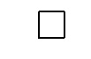|checkbox未勾选
|02|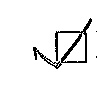|checkbox勾选
|03|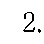|字母或数字没有圈
|04|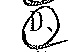|字母或数字有圈
|05|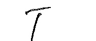|T
|06|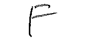|F
|07|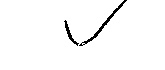|勾号
|08|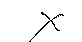|叉号
|09|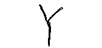|Y/y
|10||N/n
|11|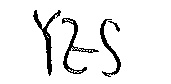|YES/yes
|12|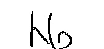|NO/no
|13||圆圈
|14||空白


## 模型训练
- 为训练集和测试集生成.csv文件
```Base
python gen_train_csv.py
```
- 启动训练
```Base
python train.py
```

## 模型预测
```Base
python predict.py
```
